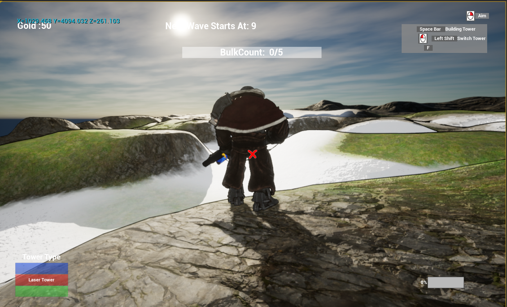
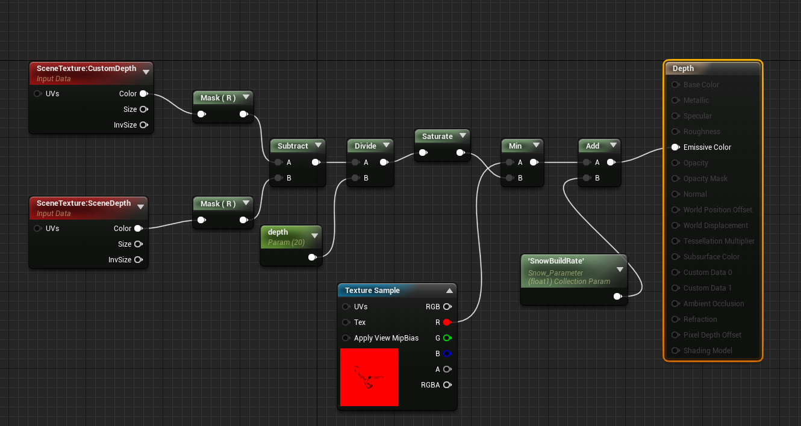
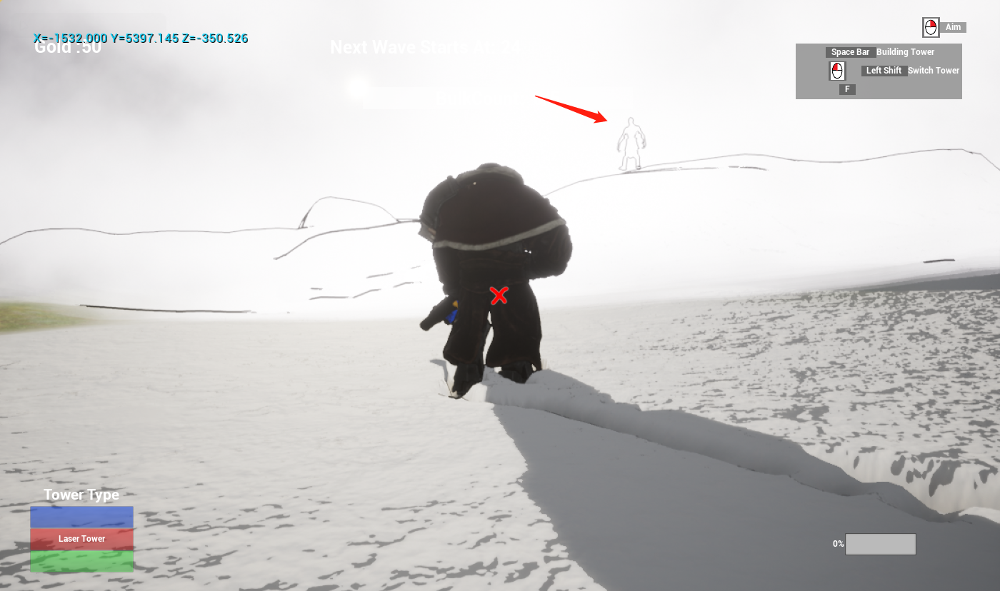
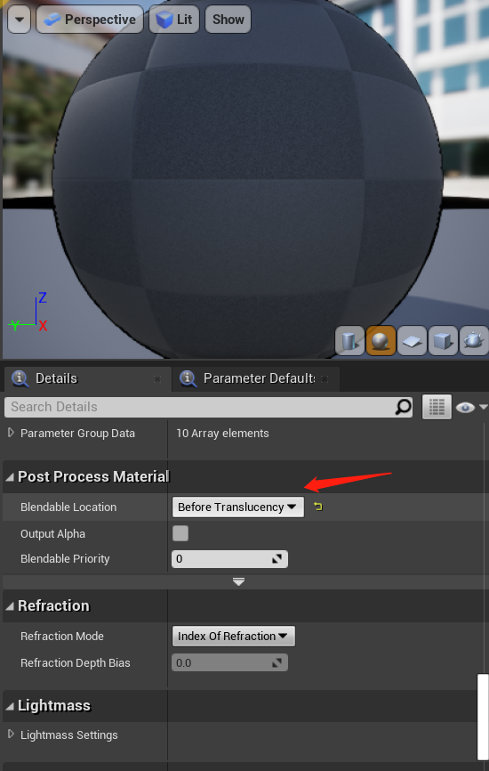
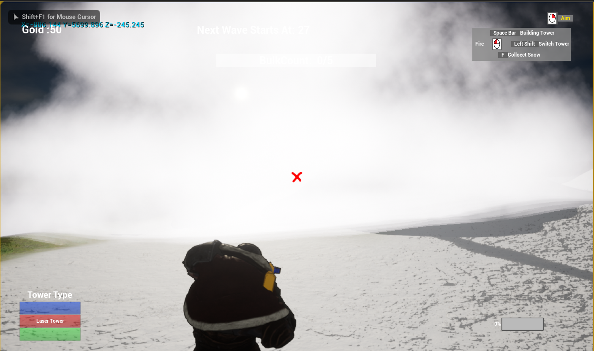

# Kai's IMGD 4000 Development Portfolio
**Website Link**: https://zhouck0811.wixsite.com/irongoat   
**Repository Link**: https://github.com/czhou2822/GitProjectGoat   

## My Role in the project
### Design
I've always wanted the opportunity to explore the implementation of interactive terrain in games. Especially after being impressed by the [interactive snow scene of rise of the tomb raider](https://www.youtube.com/watch?v=QSYkwdlDN8s), I try to take this opportunity of this course to explore the implementation of deformable snow. In order to implement this technical attempt, we designed the core gameplay of tower defense in the snow in combination with the art's expectation of the game art style in our project.   
To combine snow deformation with the core gameplay, we designed a game mechanism that can collect snow from the the snowy ground and use it to slow down the enemy. This not only demonstrates my technical goals, but is also a mechanism to make the game unqiue and fun.

### Game logic programmer
I used c++ code and animation blueprint to implement the basic control of TPS characters, such as over-shoulder aiming and shooting, the character's running, jumping and so on. 

### Graphics programmer 
I was responsible for the development of graphics and related functions of the game.
1. We chose a borderland-like cartoon style for our art style. I was responsible for the development of cel shading post process and outline post process to achieve this graphical effect.
2. I also take the responsibility of the implementation of materials and snow deformation mechanism.
3. I implemented the freezing effect when the enemy is slowed down.
4. I developed landscape material so that designers and our artists can use the built-in landscape tools to easily paint the landscape. The mechanism of snow deformation can be automatically applied on where the terrain is mapped with snow. This gives us a lot of freedom in the design of the terrain and the scene.

### Version control consultant
Because I have some experience on git, I often solve the problem of using git for my teammates. For example, resolving conflicts, reverting versions, etc.

## Technical goals
### Individual goals
1. The implementation ofsnow deformation in UE4.
2. Use unreal c++ and animation state machine to implement TPS character control.
3. Toon shading post proccess (Cel shading + silhouette outline).
4. Landscape material development.
5. Learn to use unreal material editor and material blueprint.
6. Learn how to customize shader in unreal
7. Explore the way unreal C++ interacts with blueprints.

### Team goals
1. Implementation of TPS game mechanics, including over-shoulder shooting and collision testing.
2. Tower defender game mechanic implementation, including tower building, tower placement, various defense tower behaviors, enemy AI, etc.

## Implementation process and Challenges
### Snow deformation

#### Implementation
1. Enable the skeletalmeshComponent Render CustomDepth Pass under the rendering tag of details. This option allows the character in the CustomDepth Pass, whether it is visible or not. This allows us to access the depth of the character at any time by reading the customDepth buffer.
2. Capture a  screenshot from below the floor using captureComponent2D.
3. Use a Depth of material to post-process the scene screenshot.
4. In the material named depth in the project file, the comparison between CustomDepth and SceneDepth can determine the position of the character standing. Mark the place where the character stands as black and the rest as red. Then, We save the post-processing results into renderTarget2D named Snow_Scene_Captur_RTT1.
5. In the landscape rendering material, Snow_Scene_Captur_RTT1 can be used as LUT to find the places where character have stepped on, and tessellation and world displacement can be used to achieve snow deformation.
6. In order to save the character's footprint, we also need to draw Snow_Scene_Captur_RTT1 into Snow_Scene_Captur_RTT2 (renderTarget2D) using a material named Snow_ADDRTT for each frame. In step 4, Snow_Scene_Captur_RTT2 was written to Snow_Scene_Captur_RTT1 with the latest footprint data superposition.   

Depth material blueprint:

#### Limitations and challenges
Initially, the captureComponent2D I used was fixed to the scene. When we first started prototyping, the scene was small (2048 * 2048). CaptureComponent2D can easily cover the whole scene and capture the depth of the whole scene. But as the project progressed, our scene grew larger and larger (30,000 * 30,000). Using captureComponent2D capture on such a large scale is devastating on performance. The large size of renderTarget2D also have a significant impact on the performance of the game.   
#### Optimization and solution
1. Let captureComponent2D move with character and capture scope is fixed.   
Since our game is in TPS control mode, in fact, our camera can only see a certain range of snow around the character, so only the information of snow deformation around the character needs to be recorded. This greatly optimizes the performance of the game.
2. Adjustment of parameters of captureComponent2D   
By default, captureComponent2D takes a screenshot of a scene with light, shadow, and reflection, but we only need depth in our program.  So, we can save performace cost by turning off unnecessary rendering options by adjusting the options under SceneCapture tag in detail setting of the component.

### Toon shading post process

#### Implementation
1. The cel shading   
I use the method from [Unreal Engine Forums](https://forums.unrealengine.com/development-discussion/rendering/114452-tutorial-simi-celshade-postprocess-material-work-with-light-color-point-lights-and-skybox), extracting the lighting information by using SceneColor to divide DiffuseColor, using a threshold value to determine whether the current pixel is bright or dark to get the effect of cartoon coloring.
2. The outline generation   
Generate outer line: the depth convolution/filter is used to calculate the difference  between the depth of the current pixel and the depth of the surrounding pixel. Where the difference is big enough is the silhouette of  objects and needs to be outlined.    
Generate inner outer: similarly, the difference between the normals of the current pixel and the normals of the surrounding pixel can be calculated using convolution/filter. Where we have a big difference in normals is the silhouette of objects and we need to draw outline on. Since unreal uses deferred rendering, we can easily obtain the world normal of each pixel for calculation by accessing G-buffer.

#### Issue
Outline post process is not right when working with transparent objects, such as particle systems.
In the picture below, even though the fog is thick, we can still see the outline of the enemy, which is not what we want.

#### Solution
Adjust the Blendable Location to Before Translucency in Post Process Material.
   
This option makes the post-processing be done before the transparent object is drawn, so that the transparent or translucent object can be properly blended into the scene color.   
Correct result:

#### Analysis of advantages and disadvantages
The use of post-processing to do toon shading is somewhat simple, we can unify the processing and adjustment of the entire game style and effect. But this is also its disadvantage. We lose the freedom to regulate individual objects. Post-processing outline will produce too many black edges for non-smooth objects, but will do well for more smooth and round objects.
