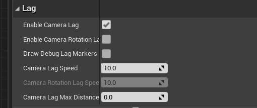

# Kai's IMGD 4000 Development Portfolio
**Website Link**: https://zhouck0811.wixsite.com/irongoat   
**Repository Link**: https://github.com/czhou2822/GitProjectGoat   

## My Role in the project
### Design
I've always wanted the opportunity to explore the implementation of interactive terrain in games. Especially after being impressed by the [interactive snow scene of rise of the tomb raider](https://www.youtube.com/watch?v=QSYkwdlDN8s), I try to take this opportunity of this course to explore the implementation of deformable snow. In order to implement this technical attempt, we designed the core gameplay of tower defense in the snow in combination with the art's expectation of the game art style in our project.   
To combine snow deformation with the core gameplay, we designed a game mechanism that can collect snow from the the snowy ground and use it to slow down the enemy. This not only demonstrates my technical goals, but is also a mechanism to make the game unqiue and fun.

### Game logic programmer
I used c++ code and animation blueprint to implement the basic control of TPS characters, such as over-shoulder aiming and shooting, the character's running, jumping and so on. 

### Graphics programmer 
I was responsible for the development of graphics and related functions of the game.
1. We chose a borderland-like cartoon style for our art style. I was responsible for the development of cel shading post process and outline post process to achieve this graphical effect.
2. I also take the responsibility of the implementation of materials and snow deformation mechanism.
3. I implemented the freezing effect when the enemy is slowed down.
4. I developed landscape material so that designers and our artists can use the built-in landscape tools to easily paint the landscape. The mechanism of snow deformation can be automatically applied on where the terrain is mapped with snow. This gives us a lot of freedom in the design of the terrain and the scene.

### Version control consultant
Because I have some experience on git, I often solve the problem of using git for my teammates. For example, resolving conflicts, reverting versions, etc.

## Technical goals
### Individual goals
1. The implementation ofsnow deformation in UE4.
2. Use unreal c++ and animation state machine to implement TPS character control.
3. Toon shading post proccess (Cel shading + silhouette outline).
4. Landscape material development.
5. Learn to use unreal material editor and material blueprint.
6. Learn how to customize shader in unreal
7. Explore the way unreal C++ interacts with blueprints.

### Team goals
1. Implementation of TPS game mechanics, including over-shoulder shooting and collision testing.
2. Tower defender game mechanic implementation, including tower building, tower placement, various defense tower behaviors, enemy AI, etc.

## Implementation process and Challenges
### Snow deformation

#### Implementation
1. Enable the skeletalmeshComponent Render CustomDepth Pass under the rendering tag of details. This option allows the character in the CustomDepth Pass, whether it is visible or not. This allows us to access the depth of the character at any time by reading the customDepth buffer.
2. Capture a  snapshot from below the floor using captureComponent2D.[Diagram](Images/Capture.png)
3. Use a post-process material name Depth to process the scene snapshot.
4. In the material named Depth in the project file, the comparison between CustomDepth and SceneDepth can determine the position where the character standing on. Mark the place where the character stands on as black and the rest as red. Then, save the post-processing results into renderTarget2D named Snow_Scene_Captur_RTT1.
5. In the landscape rendering material, Snow_Scene_Captur_RTT1 can be used as LUT to find the places where character have stepped on, and tessellation and world displacement can be used to achieve snow deformation.
6. In order to save the character's footprint, we also need to draw Snow_Scene_Captur_RTT1 into Snow_Scene_Captur_RTT2 (renderTarget2D) using a material named Snow_ADDRTT for each frame. In step 4, we need to blend Snow_Scene_Captur_RTT2 to genrate the final result, because it consists of the information of character's footprint in last frame.

Depth material blueprint:

#### Limitations and challenges
Initially, the captureComponent2D I used was fixed to the scene. When we first started prototyping, the scene was small (2048 * 2048). CaptureComponent2D can easily cover the whole scene and capture the depth of the whole scene. But as the project progressed, our scene grew larger and larger (30,000 * 30,000). Using captureComponent2D capture on such a large scale is devastating on performance. The large size of renderTarget2D also have a significant impact on the performance of the game.   
#### Optimization and solution
1. Let captureComponent2D move with character and capture scope is fixed.   
Since our game is in TPS control mode, in fact, our camera can only see a certain range of snow around the character, so only the information of snow deformation around the character needs to be recorded. This greatly optimizes the performance of the game.
2. Adjustment of parameters of captureComponent2D   
By default, captureComponent2D takes a screenshot of a scene with light, shadow, and reflection, but we only need depth in our program.  So, we can save performace cost by turning off unnecessary rendering options by adjusting the options under SceneCapture tag in detail setting of the component.

### Toon shading post process

#### Implementation
1. The cel shading   
I use the method from [Unreal Engine Forums](https://forums.unrealengine.com/development-discussion/rendering/114452-tutorial-simi-celshade-postprocess-material-work-with-light-color-point-lights-and-skybox), extracting the lighting information by using SceneColor to divide DiffuseColor, using a threshold value to determine whether the current pixel is bright or dark to get the effect of cartoon coloring.
2. The outline generation   
Generate outer line: the depth convolution/filter is used to calculate the difference  between the depth of the current pixel and the depth of the surrounding pixel. Where the difference is big enough is the silhouette of  objects and needs to be outlined.    
Generate inner outer: similarly, the difference between the normals of the current pixel and the normals of the surrounding pixel can be calculated using convolution/filter. Where we have a big difference in normals is the silhouette of objects and we need to draw outline on. Since unreal uses deferred rendering, we can easily obtain the world normal of each pixel for calculation by accessing G-buffer.

#### Issue
Outline post process is not right when working with transparent objects, such as particle systems.
In the picture below, even though the fog is thick, we can still see the outline of the enemy, which is not what we want.

#### Solution
Adjust the Blendable Location to Before Translucency in Post Process Material.
   
This option makes the post-processing be done before the transparent object is drawn, so that the transparent or translucent object can be properly blended into the scene color.   
Correct result:

#### Analysis of advantages and disadvantages
The use of post-processing to do toon shading is somewhat simple, we can unify the processing and adjustment of the entire game style and effect. But this is also its disadvantage. We lose the freedom to regulate individual objects. Post-processing outline will produce too much inner lines for non-smooth objects, but will do well for more smooth and round objects.

### TPS character control
#### Implementation
The main C++ code is integrated into tpscharacterq.h and tpscharacterq.cpp.
TPSCharacterQ is inherited from ACharacter, and it receives keyboard control to implement the basic operation of TPS characters using BindAxis and BindAction. It combines USpringArmComponent and UCameraComponent to achieve over-shoulder perspective shooting and aiming. By enabling the Camera Lag option of springArm, we can simulate the tween motion of the Camera when aiming at the over-shoulder Angle. As shown in figure:   
   
BP_PlayerCharaccter is a blueprint class inherited from TPSCharacterQ. In this blueprint class, we implement the interaction between the character's gun and the snow through interaction between c++ and the blueprint (snow sucking causes snow deformation).
There is a BlueprintImplementableEvent decalred in TPSCharacterQ.h. When characters using his gun to suck the snow, we make it interact with the BP_PlayerCharaccter blueprint by calling this function.The position of Snow absorption will be recorded into Snow_Scene_Captur_RTT2(mentioned above) by using Hit Snow Material in the blueprint to achieve Snow deformation.    
BlueprintImplementableEvent:   
   
Using Hit Snow Material to draw on Snow_Scene_Captur_RTT2 in blueprint:   
   
The switching between different animations implemented by using the [animationStateMachine](https://docs.unrealengine.com/en-US/Engine/Animation/AnimBlueprints/AnimGraph/index.html). [AimOffset](https://docs.unrealengine.com/en-US/Engine/Animation/AimOffset/index.html) is used in our game to adjust the angle of the aiming action.   

#### Issue
When I was making aimOffest, I noticed that sometimes the character's hand wasn't holding the butt of the gun, like the picture below.   
   

#### Solution 
Using [IK (Inverse Kinematics)](https://docs.unrealengine.com/en-US/Engine/Animation/IKSetups/index.html) to adjust the animation, making the bone of left hand always follow the bone of right hand in aiming animation, to achieve correct result(left hand holding the gun correctly during the aiming animation).   
Correct result:   
   

### Frozen Enemy 
    
#### Implementation
Using the red channel of vertex color on the mesh to be a mark of the ice. This means that our material will only apply the ice effect where the vertex color is red. Thus, it allows our artists to paint ice effect on enemy mesh and easily change where they want to apply ice frozen effect.   
A noise texture is used in enemy's material to simulate the random distribution of snow, and the Fresnel and subsurface Shading model is to simulate the color of snow and ice. WorldPositionOffset output is used to produce icicle. In the enemy's material I blend the frozen color and the enemy's original color. Also, there is a variable exposed to control the amount of snow on the enemy. This allows us to achieve the effect that enemies are gradually frozen by our frostCannon.   
Enemy's material blueprint:   
   
I use a customized material function to calculate the materialAttributes for frozen effect.    
The customized material function - EnemyFrozen_func:      

#### Issue
In the first version, I used tessellation and worldDisplacement to generate icicle. But when there were 20 enemies in the screen at the same time, the frame rate become very low. Thant is because the mesh of our enemy has 34000+ vertices the and 25000+ triangles, if we still use the tessellation, it will be a huge performance hit.
#### Solution
The tessellation was cancelled and icicle was generated by using world position offset in current version. The result of using world position offset was similar to that of tessellation no our high-ploy model. Tessellation was more suitable for adding more details to the low-ploy model rather than on high-ploy model.

### Performance optimization and analysis
#### A strange issue
In the Alpha version of our game, we had a strange problem. During the process of the game, the video memory usage will keep increasing. About one minute after playing the game, the frame rate of the game will drop to the single digit.
#### Solution
I finally figured out the cause of the problem.
The all of defense towers in our game are doing raytracing test on the ground for every frame, and drawing a **debug line** that is permanently visible every frame. UE4 does not make batch rendering for debug lines, but draws each debug line as an instance. Thousands of debug lines cause a rapid increase in video memory, and drawcalls generated by countless debug lines affect the frame rate. It's hard to believe that the simple debug line can cause serious performance problems!

## Lessons learned
I would like to thank this course for providing me with the opportunity to work with my teammates on our ideas. Everyone was very positive and it was a good opportunity for everyone to learn from each other.
In addition to the solutions mentioned above, here are some applicable tips future students.
1. If one day you find that complie btn is missing from your unreal editor, it is probably because the primary game module you implemented using IMPLEMENT_PRIMARY_GAME_MODULE does not override the IsGameModule function, you should do so:   
   
2. GC in UE4   
As Professor Roberts mentioned in slack channel: The UObject isntance you created in GameMode should be referenced by adding UPROPERTY before the declaration or adding it to the "root set" using addToRoot, otherwise it will be garbage collected fairly quickly. [Here is a link about it](https://docs.unrealengine.com/zh-CN/Programming/UnrealArchitecture/Objects/Optimizations/index.html).
3. Debug line is dangerous!    
Do not use persistent debug line! (mentioned in the performance optimization and analysis section)

## Version control choice
I chose github for version control of our project because I have some experience it. We use the collaborator mode to wrok as a team, which avoids the need for everyone to have one branch and thousands of pull requests for the repository owner. This collaborative approach places the 'merge' work on everyone on the team, which encourages more positive communication.   
Tips: 
We can diff and merge blueprints by using Unreal version management with Git. This visual comparison method can effectively resolve blueprint conflicts:   
 

## Commit history   
 
